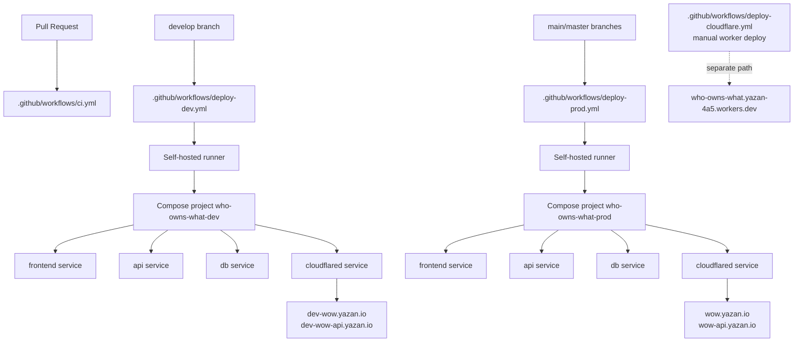

# Deploy Notes For Next LLM

Canonical deployment docs now live in `docs/DEPLOYMENT.md`; use `docs/ops-runbook.md` for operational refresh/recovery procedures. This file is retained as historical handoff notes until its unique details are fully merged.

This repo now has a real dev/prod split on the same host.

## Branch To Environment Mapping

- `develop` auto-deploys `dev`
- `main` and `master` auto-deploy `prod`
- PRs run CI only

## What Actually Serves The App

The live sites are not backed by the Cloudflare Worker deploy.

They are served by Docker stacks behind Cloudflare Tunnels on the self-hosted production runner.

## Domains

- Dev frontend: `https://dev-wow.yazan.io`
- Dev API: `https://dev-wow-api.yazan.io`
- Prod frontend: `https://wow.yazan.io`
- Prod API: `https://wow-api.yazan.io`

## Compose Projects

- Dev compose project: `who-owns-what-dev`
- Prod compose project: `who-owns-what-prod`

`docker-compose.prod.yml` no longer hardcodes `container_name`, so both stacks can coexist on one server.

## Runner Env Files

These files must exist on the self-hosted runner:

- `/home/actions/who-owns-what-dev.env`
- `/home/actions/who-owns-what-prod.env`

They must differ at least in:

- `DATABASE_URL`
- `SECRET_KEY`
- `CLOUDFLARE_TUNNEL_TOKEN`
- `FRONTEND_API_BASE_URL`
- `ALLOWED_HOSTS`
- `CORS_EXTRA_ALLOWED_ORIGINS`
- `CSRF_EXTRA_TRUSTED_ORIGINS`
- `ADMIN_API_TOKEN`
- `ALERTS_API_TOKEN`
- `SIGNATURE_API_TOKEN`
- `ROLLBAR_ACCESS_TOKEN`
- `FRONTEND_ROLLBAR_ACCESS_TOKEN`

Recommended URL values:

- Dev:
  - `FRONTEND_API_BASE_URL=https://dev-wow-api.yazan.io`
  - `ALLOWED_HOSTS=dev-wow-api.yazan.io,localhost,127.0.0.1`
  - `CORS_EXTRA_ALLOWED_ORIGINS=https://dev-wow.yazan.io`
  - `CSRF_EXTRA_TRUSTED_ORIGINS=https://dev-wow.yazan.io`
- Prod:
  - `FRONTEND_API_BASE_URL=https://wow-api.yazan.io`
  - `ALLOWED_HOSTS=wow-api.yazan.io,localhost,127.0.0.1`
  - `CORS_EXTRA_ALLOWED_ORIGINS=https://wow.yazan.io`
  - `CSRF_EXTRA_TRUSTED_ORIGINS=https://wow.yazan.io`

## System Graph



## Workflows

- `.github/workflows/ci.yml`
  - PR and branch CI
  - backend: `pytest tests --ignore=tests/test_sql.py`
  - frontend: `yarn build`
- `.github/workflows/deploy-dev.yml`
  - auto deploy on `develop`
  - deploys `api`, `frontend`, and `cloudflared`
  - verifies local API health
  - verifies public `dev-wow.yazan.io` asset hashes match rebuilt frontend assets
- `.github/workflows/deploy-prod.yml`
  - auto deploy on `main` and `master`
  - deploys `api`, `frontend`, and `cloudflared`
  - verifies local API health
  - verifies public `wow.yazan.io` asset hashes match rebuilt frontend assets
- `.github/workflows/integration-sql.yml`
  - manual and nightly SQL integration workflow
  - runs `pytest tests/test_sql.py`
  - uses a PostGIS service plus the test fixture's empty supplemental source/bootstrap tables
- `.github/workflows/deploy-cloudflare.yml`
  - manual only
  - deploys the separate Worker bundle
  - does not update the tunnel-backed live sites

## CI Strategy

- Fast branch CI is intentionally separate from heavy SQL integration coverage.
- `tests/test_sql.py` is excluded from `.github/workflows/ci.yml` so normal branch pushes stay fast and reliable.
- SQL integration coverage lives in `.github/workflows/integration-sql.yml` and should be run explicitly when changing SQL/data-loading behavior.
- It also runs nightly to catch drift in SQL/bootstrap assumptions without slowing every branch push.

## Merge Strategy

- For future workflow/infrastructure changes, prefer feature branches plus PRs.
- Use squash merge for infra/workflow PRs so `develop` and `master` do not accumulate long fixup chains.
- Avoid force-pushing `develop` or `master` just to rewrite already-shared history.

## Real Deploy Commands

Dev:

```sh
cp /home/actions/who-owns-what-dev.env .env
docker compose --project-name who-owns-what-dev --env-file .env -f docker-compose.prod.yml --profile with-cloudflare up -d --build api frontend cloudflared
```

Prod:

```sh
cp /home/actions/who-owns-what-prod.env .env
docker compose --project-name who-owns-what-prod --env-file .env -f docker-compose.prod.yml --profile with-cloudflare up -d --build api frontend cloudflared
```

## Verification Commands

Check local stack health:

```sh
docker compose --project-name who-owns-what-dev --env-file .env -f docker-compose.prod.yml --profile with-cloudflare ps
docker compose --project-name who-owns-what-prod --env-file .env -f docker-compose.prod.yml --profile with-cloudflare ps
```

Check public shell asset hashes:

```sh
curl -s -A "Mozilla/5.0" https://dev-wow.yazan.io | python3 -c 'import re,sys; html=sys.stdin.read();
for pat in [r"/static/css/main\.[a-f0-9]+\.chunk\.css", r"/static/js/main\.[a-f0-9]+\.chunk\.js"]:
 m=re.search(pat, html); print(m.group(0) if m else "MISSING")'

curl -s -A "Mozilla/5.0" https://wow.yazan.io | python3 -c 'import re,sys; html=sys.stdin.read();
for pat in [r"/static/css/main\.[a-f0-9]+\.chunk\.css", r"/static/js/main\.[a-f0-9]+\.chunk\.js"]:
 m=re.search(pat, html); print(m.group(0) if m else "MISSING")'
```

Check public API health:

```sh
curl -fsSL https://dev-wow-api.yazan.io/api/health/
curl -fsSL https://wow-api.yazan.io/api/health/
```

## Required Manual Infrastructure Setup

GitHub Actions cannot create all of this by itself. The following must exist outside the repo:

1. A dev Cloudflare Tunnel
2. DNS records:
   - `dev-wow.yazan.io -> <dev-tunnel-id>.cfargotunnel.com`
   - `dev-wow-api.yazan.io -> <dev-tunnel-id>.cfargotunnel.com`
3. A dev database separate from prod
4. The two runner env files listed above

Current status:

- `/home/actions/who-owns-what-dev.env` now contains a dedicated dev tunnel token
- dedicated dev tunnel:
  - ID: `e3fc65bd-5145-4210-98ad-b2429a70f7fb`
  - name: `wow_dev_112`
- remote ingress is configured for:
  - `dev-wow-api.yazan.io -> http://api:8000`
  - `dev-wow.yazan.io -> http://frontend:80`
- the local dev cloudflared service is running and the tunnel is healthy
- public DNS now exists:
  - `dev-wow.yazan.io -> e3fc65bd-5145-4210-98ad-b2429a70f7fb.cfargotunnel.com`
  - `dev-wow-api.yazan.io -> e3fc65bd-5145-4210-98ad-b2429a70f7fb.cfargotunnel.com`
- public frontend responds normally at `https://dev-wow.yazan.io`
- public API responds through the correct Cloudflare edge IP and tunnel
- note: this machine's default resolver briefly kept a stale answer for `dev-wow-api.yazan.io`; authoritative/public DNS is correct

## Important Warning

If someone says “deployment succeeded”, the only result that matters for the real app is:

1. local compose services are healthy
2. the public domain for that environment serves the rebuilt asset hashes
3. the public API health endpoint responds

The Worker deploy is not the source of truth for either live environment.
